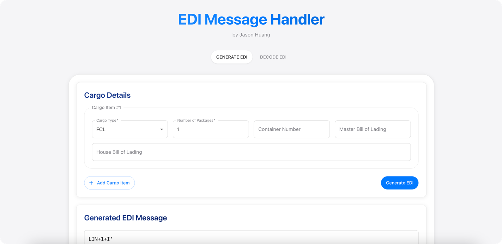

# EDI Message Handler 
@Jason Huang

**🔗 Online Demo: [http://3.25.202.61:8000](http://3.25.202.61:8000)**  
⚠️ *Please use HTTP only. HTTPS is not supported.*

A full-stack web application for generating and decoding EDI (Electronic Data Interchange) messages for cargo shipments. This application provides a user-friendly interface for managing cargo shipment data and converting it to/from standard EDI formats.


## Project Structure

```
.
├── backend/              # FastAPI backend
│   ├── app/             # Application code
│   │   ├── api/         # API routes
│   │   ├── core/        # Core functionality
│   │   ├── models/      # Data models
│   │   └── utils/       # Utility functions
│   └── tests/           # Test files
└── frontend/            # React frontend
    └── src/             # Source code
        ├── components/  # React components
        └── utils/       # Utility functions
```

## Features

- Generate EDI messages from cargo details
- Decode existing EDI messages
- Support for multiple cargo items
- Input validation and error handling
- Comprehensive API documentation
- Real-time validation
- Modern, responsive UI

## Prerequisites

- Python 3.8 or higher
- Node.js 14 or higher
- npm 6 or higher
- Git

## Setup

### Backend

1. Navigate to the backend directory:
```bash
cd backend
```

2. Create and activate a virtual environment:
```bash
python -m venv venv
source venv/bin/activate  # On Windows: venv\Scripts\activate
```

3. Install dependencies:
```bash
pip install -r requirements.txt
```

4. Start the server:
```bash
uvicorn app.main:app --reload
```

The backend will be available at http://localhost:8000

### Frontend

1. Navigate to the frontend directory:
```bash
cd frontend
```

2. Install dependencies:
```bash
npm install
```

3. Start the development server:
```bash
npm start
```

The frontend will be available at http://localhost:3000

## API Documentation

Once the backend server is running, you can access the API documentation at:
- Swagger UI: http://localhost:8000/docs
- ReDoc: http://localhost:8000/redoc

## Testing

### Backend Tests
```bash
cd backend
pytest
```

## Technologies Used

- Backend:
  - FastAPI
  - Python 3.8+
  - Pydantic
  - Uvicorn
  - pytest

- Frontend:
  - React
  - Material-UI
  - Axios
  - React Hooks
  - Jest
